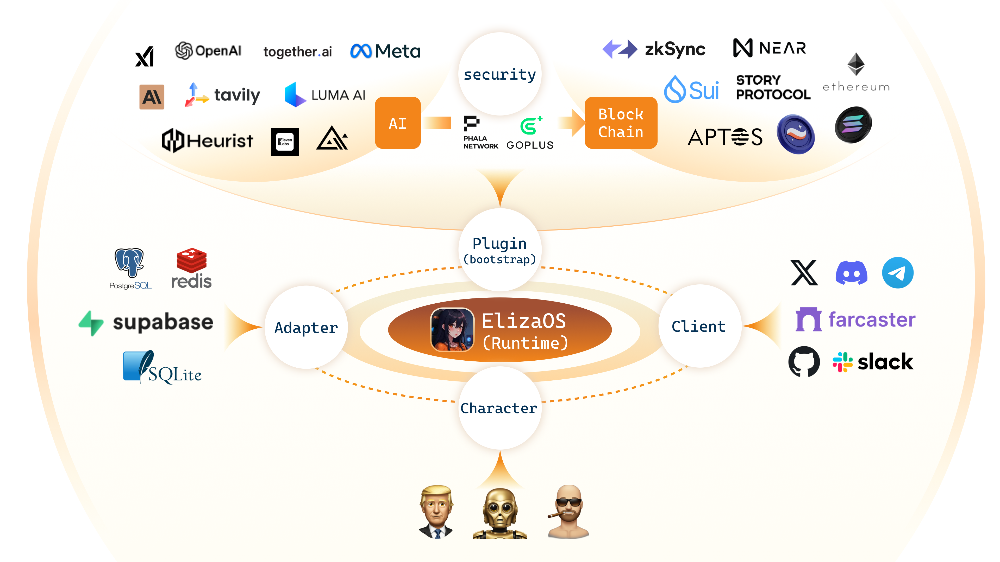

# الیزا 🤖

<div align="center">
  
</div>

<div align="center">

📖 [مستندات](https://elizaos.github.io/eliza/) | 🎯 [نمونه‌ها](https://github.com/thejoven/awesome-eliza)

</div>

## 🚩 معرفی کلی

<div align="center">
  
</div>

## ✨ ویژگی‌ها

- 🛠️ پشتیبانی کامل از اتصال به دیسکورد، توییتر و تلگرام
- 🔗 سازگاری با همه مدل‌ها (Llama، Grok، OpenAI، Anthropic و غیره)
- 👥 پشتیبانی از چند عامل و چند اتاق
- 📚 مدیریت و تعامل آسان با اسناد شما
- 💾 حافظه و ذخیره‌سازی اسناد قابل بازیابی
- 🚀 بسیار قابل گسترش - امکان ایجاد اکشن‌ها و کلاینت‌های سفارشی
- ☁️ پشتیبانی از مدل‌های مختلف (local Llama, OpenAI، Anthropic, etc. )
- 📦 به سادگی کار می‌کند!

## آموزش‌های ویدیویی

[AI Agent Dev School](https://www.youtube.com/watch?v=ArptLpQiKfI&list=PLx5pnFXdPTRzWla0RaOxALTSTnVq53fKL)

## 🎯 موارد استفاده

- 🤖 چت‌بات‌ها
- 🕵️ عوامل خودکار
- 📈 مدیریت فرآیندهای کسب‌وکار
- 🎮 کاراکترهای بازی‌های ویدیویی
- 🧠 معاملات تجاری

## 🚀 شروع سریع

### پیش‌نیازها

- [Python 2.7+](https://www.python.org/downloads/)
- [Node.js 23+](https://docs.npmjs.com/downloading-and-installing-node-js-and-npm)
- [pnpm](https://pnpm.io/installation)

> **توجه برای کاربران ویندوز:** [WSL 2](https://learn.microsoft.com/en-us/windows/wsl/install-manual) لازم است.

### استفاده از پروژه آغازین (توصیه‌شده)

```bash
git clone https://github.com/elizaos/eliza-starter.git
cd eliza-starter
cp .env.example .env
pnpm i && pnpm build && pnpm start
```

پس از اجرای عامل، باید پیامی برای اجرای "pnpm start:client" دریافت کنید.
یک ترمینال جدید باز کنید و به همان دایرکتوری رفته و دستور زیر را اجرا کنید تا با عامل خود گفتگو کنید:

```bash
pnpm start:client
```

سپس [مستندات](https://elizaos.github.io/eliza/) را مطالعه کنید تا بیاموزید چگونه الیزا را سفارشی کنید.

### اجرای دستی الیزا (فقط در صورتی که تخصص دارید توصیه می‌شود)

```bash
# کلون کردن مخزن
git clone https://github.com/elizaos/eliza.git

# انتخاب آخرین نسخه پایدار
# این پروژه سریع به‌روزرسانی می‌شود، پیشنهاد می‌کنیم آخرین نسخه پایدار را انتخاب کنید
git checkout $(git describe --tags --abbrev=0)
# اگر دستور بالا آخرین نسخه را انتخاب نکرد، این دستور را امتحان کنید:
# git checkout $(git describe --tags `git rev-list --tags --max-count=1`)
```

### اجرای الیزا با Gitpod

[](https://gitpod.io/#https://github.com/elizaos/eliza/tree/main)

### ویرایش فایل .env

یک کپی از .env.example بگیرید و مقادیر مناسب را وارد کنید:

```
cp .env.example .env
```

توجه: فایل .env اختیاری است. اگر قصد دارید چندین عامل متمایز اجرا کنید، می‌توانید اطلاعات محرمانه را از طریق فایل JSON شخصیت انتقال دهید.

### شروع خودکار الیزا

این دستور همه مراحل راه‌اندازی پروژه را انجام داده و بات را با شخصیت پیش‌فرض اجرا می‌کند:

```bash
sh scripts/start.sh
```

### ویرایش فایل شخصیت

1. فایل `packages/core/src/defaultCharacter.ts` را باز کنید تا شخصیت پیش‌فرض را تغییر دهید. تغییرات لازم را انجام دهید.
2. برای بارگذاری شخصیت‌های سفارشی:
    - از دستور `pnpm start --characters="path/to/your/character.json"` استفاده کنید.
    - چندین فایل شخصیت می‌توانند همزمان بارگذاری شوند.
3. اتصال به توییتر (X):
    - مقدار `"clients": []` را به `"clients": ["twitter"]` در فایل شخصیت تغییر دهید.

### اجرای دستی الیزا

```bash
pnpm i
pnpm build
pnpm start

# اگر پروژه به دلیل تغییرات سریع نیاز به پاکسازی داشت، دستور زیر را اجرا کنید:
pnpm clean
```

#### نیازمندی‌های اضافی

ممکن است نیاز به نصب Sharp باشد. اگر هنگام راه‌اندازی خطایی دیدید، دستور زیر را اجرا کنید:

```
pnpm install --include=optional sharp
```

### انجمن و تماس

- [مشکلات در GitHub](https://github.com/elizaos/eliza/issues). بهترین گزینه برای گزارش باگ‌ها و پیشنهاد ویژگی‌ها.
- [Discord](https://discord.gg/ai16z). بهترین گزینه برای به اشتراک گذاشتن برنامه‌های شما و ارتباط با جامعه.

## مشارکت‌کنندگان

<a href="https://github.com/elizaos/eliza/graphs/contributors">
  
</a>

## تاریخچه ستاره‌ها

[](https://star-history.com/#elizaos/eliza&Date)

