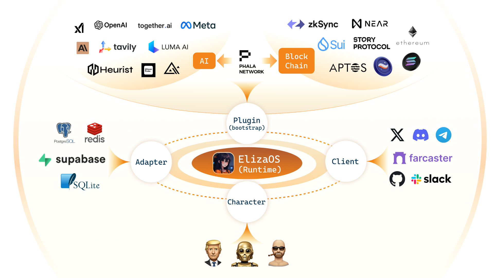

# Eliza 🤖

<div align="center">
  
</div>

<div align="center">

📖 [문서](https://elizaos.github.io/eliza/) | 🎯 [예시](https://github.com/thejoven/awesome-eliza)

</div>

## 🚩 구조

<div align="center">
  
</div>

## ✨ 기능

- 🛠 SNS 지원: 디스코드, 트위터, 텔레그램 연동 지원
- 🔗 다양한 모델 지원 (Llama, Grok, OpenAI, Anthropic 등)
- 👥 다중 지원: 다중 에이전트 및 채팅방 지원
- 📚 높은 유연성: 데이터를 쉽게 추가하고 다양한 상호작용 가능
- 💾 검색 지원: 데이터와 작업을 쉽게 찾아볼 수 있도록 검색 기능 지원
- 🚀 높은 확장성: 사용자 정의 동작 및 클라이언트 생성 가능
- ☁️ 다양한 AI 모델 지원: local Llama, OpenAI, Anthropic, Groq 등 다양한 AI 모델을 지원합니다
- 📦 즐겁게 개발해 봐요!

## 튜토리얼 동영상

[AI Agent Dev School](https://www.youtube.com/watch?v=ArptLpQiKfI&list=PLx5pnFXdPTRzWla0RaOxALTSTnVq53fKL)

## 🎯 사용 사례

- 🤖 챗봇
- 🕵 ️자율 에이전트
- 📈 자동화 프로세스
- 🎮 비디오 게임 NPC
- 🧠 트레이딩

## 💰 토큰을 출시할 계획이 있으시다면

이 프레임워크는 GitHub에서 가장 인기 있는 오픈 소스 프로젝트로, 차세대 인간-기계 인터페이스를 가능하게 합니다. 하지만 빌더 커뮤니티 전반에 영향을 미칠 중요한 문제들에 신속히 대응하고 코드의 최고 품질을 보장하기 위해 여전히 여러분의 도움이 필요합니다.

지속 가능한 개발과 혁신을 위해, 성공적으로 출시된 토큰의 초기 분배량 중 5-10%를 기부해 주실 것을 요청드립니다.

모든 기부는 온체인에서 공개적으로 추적되며, 생태계 개발에만 독점적으로 사용됩니다.

### ⚠️ 큰 형님께 10%를 기부하는 것을 잊지 마세요 ⚠️
[AM84n1iLdxgVTAyENBcLdjXoyvjentTbu5Q6EpKV1PeG](https://solscan.io/account/AM84n1iLdxgVTAyENBcLdjXoyvjentTbu5Q6EpKV1PeG)

## 🚀 빠른 시작

### 필수 요구사항:

- [Python 2.7+](https://www.python.org/downloads/)
- [Node.js 23.3+](https://docs.npmjs.com/downloading-and-installing-node-js-and-npm)
- [pnpm](https://pnpm.io/installation)

> **Windows 사용자 참고:** [WSL 2](https://learn.microsoft.com/en-us/windows/wsl/install-manual) 필요.

### Starter 사용 (권장)

```bash
git clone https://github.com/elizaos/eliza-starter.git
cd eliza-starter
cp .env.example .env
pnpm i && pnpm build && pnpm start
```

에이전트가 실행되면, 마지막에 "pnpm start:client" 명령을 실행하라는 메시지를 볼 수 있습니다.

다른 터미널을 열고 같은 디렉터리로 이동한 다음 아래 명령어를 실행하세요. 

그리고 제공된 URL을 따라 에이전트와 대화하세요.
```bash
pnpm start:client
```

[문서](https://elizaos.github.io/eliza/)를 참고하여 Eliza를 커스마이징 방법을 확인하세요.

### 수동으로 실행 (사용법을 알고 있는 경우에만 권장)

```bash
# 저장소 복사
git clone https://github.com/elizaos/eliza.git

# 최신 릴리스로 체크아웃
# 프로젝트가 빠르게 수정되므로 최신 릴리스를 체크아웃하는 것을 권장합니다.
git checkout $(git describe --tags --abbrev=0)
```

### Gitpod로 Eliza 시작

[](https://gitpod.io/#https://github.com/elizaos/eliza/tree/main)

### .env 파일 편집

.env.example을 복사해서 필요한 값들을 채워넣어 .env파일을 만드세요.

```
cp .env.example .env
```

참고: .env는 선택 사항입니다. 여러 개의 에이전트를 실행하려는 경우, 캐릭터 JSON 파일을 통해 비밀 변수를 전달할 수 있습니다.

### Eliza 자동 시작

아래 명령은 프로젝트를 설정하고 기본 캐릭터와 함께 봇을 시작합니다.

```bash
sh scripts/start.sh
```

### character file 편집

1. `packages/core/src/defaultCharacter.ts`를 열어 기본 캐릭터를 수정하세요. 주석을 해제하고 수정하시면 됩니다.

2. 커스텀 캐릭터 로드하기:
    - `pnpm start --characters="path/to/your/character.json"`을 사용합니다.
    - 여러 캐릭터 파일을 동시에 로드할 수 있습니다.
3. X (Twitter) 연결:
    - 캐릭터 파일에서 `"clients": []`를 `"clients": ["twitter"]`로 변경합니다.

### Eliza 수동 시작

```bash
pnpm i
pnpm build
pnpm start

# 프로젝트가 빠르게 변경되기 때문에, 다시 작업을 시작할 때는 clean 명령어 입력이 필요할 수도 있습니다.
pnpm clean
```

#### 추가 요구 사항

시작 시 에러가 발생하면 Sharp를 설치해야 할 수 있습니다. 아래 명령어를 사용하여 설치하세요:

```
pnpm install --include=optional sharp
```

### 커뮤니티 & 문의

- [Github Issues](https://github.com/elizaos/eliza/issues). 용도: Eliza 사용 중 발견된 버그 리포트, 기능 제안.
- [Discord](https://discord.gg/ai16z). 용도: 애플리케이션 공유 및 커뮤니티 활동.
- [Developer Discord](https://discord.gg/3f67SH4rXT). 용도: 도움요청 및 플러그인 개발

## 기여자

<a href="https://github.com/elizaos/eliza/graphs/contributors">
  
</a>

## 스타 기록

[](https://star-history.com/#elizaos/eliza&Date)
