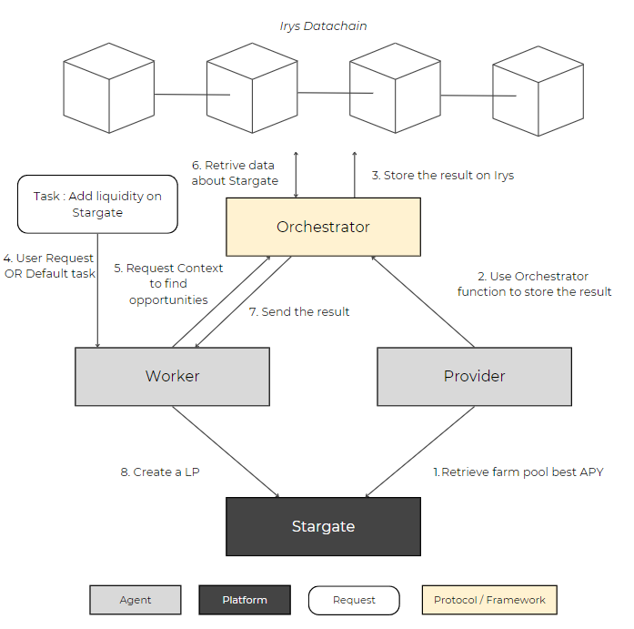

# @elizaos/plugin-irys

A plugin for ElizaOS that enables decentralized data storage and retrieval using Irys, a programmable datachain platform.

## Overview

This plugin integrates Irys functionality into ElizaOS, allowing agents to store and retrieve data in a decentralized manner. It provides a service for creating a decentralized knowledge base and enabling multi-agent collaboration.

## Installation

To install this plugin, run the following command:

```bash
pnpm add @elizaos/plugin-irys
```

## Features

- **Decentralized Data Storage**: Store data permanently on the Irys network
- **Data Retrieval**: Fetch stored data using GraphQL queries
- **Multi-Agent Support**: Enable data sharing and collaboration between agents
- **Ethereum Integration**: Built-in support for Ethereum wallet authentication

## Configuration

The plugin requires the following environment variables:

- `EVM_WALLET_PRIVATE_KEY`: Your EVM wallet private key
- `AGENTS_WALLET_PUBLIC_KEYS`: The public keys of the agents that will be used to retrieve the data (string separated by commas)

For this plugin to work, you need to have an EVM (Base network) wallet with a private key and public address. To prevent any security issues, we recommend using a dedicated wallet for this plugin.

> **Important**: The wallet address needs to have Base Sepolia ETH tokens to store images/files and any data larger than 100KB.

## How it works



The system consists of three main components that work together to enable decentralized multi-agent operations:

### 1. Providers
Providers are the data management layer of the system. They:
- Interact with the Orchestrator to store data
- Aggregate information from multiple sources to enhance context
- Support agents with enriched data for better decision-making

### 2. Orchestrators
Orchestrators manage the flow of communication and requests. They:
- Interact with the Irys datachain to store and retrieve data
- Implement a tagging system for request categorization
- Validate data integrity and authenticity
- Coordinate the overall system workflow

### 3. Workers
Workers are specialized agents that execute specific tasks. They:
- Perform autonomous operations (e.g., social media interactions, DeFi operations)
- Interact with Orchestrators to get contextual data from Providers
- Interact with Orchestrators to store execution results on the Irys datachain
- Maintain transparency by documenting all actions

This architecture ensures a robust, transparent, and efficient system where:
- Data is securely stored and verified on the blockchain
- Requests are properly routed and managed
- Operations are executed autonomously
- All actions are traceable and accountable

You can find more information about the system in the [A Decentralized Framework for Multi-Agent Systems Using Datachain Technology](https://trophe.net/article/A_Decentralized_Framework_for_Multi-Agent_Systems_Using_Datachain_Technology.pdf) paper.

## Usage

### Worker

As a worker, you can store data on the Irys network using the `workerUploadDataOnIrys` function. You can use this function to store data from any source to document your actions. You can also use this function to store a request to get data from the Orchestrator to enhance your context.

```typescript
const { IrysService } = require('@elizaos/plugin-irys');

const irysService : IrysService = runtime.getService(ServiceType.IRYS)
const data = "Provide Liquidity to the ETH pool on Stargate";
const result = await irysService.workerUploadDataOnIrys(
    data,
    IrysDataType.OTHER,
    IrysMessageType.DATA_STORAGE,
    ["DeFi"],
    ["Stargate", "LayerZero"]
);
console.log(`Data uploaded successfully at the following url: ${result.url}`);
```

To upload files or images :

```typescript
const { IrysService } = require('@elizaos/plugin-irys');

const irysService : IrysService = runtime.getService(ServiceType.IRYS)
const userAttachmentToStore = state.recentMessagesData[1].content.attachments[0].url.replace("agent\\agent", "agent");

const result = await irysService.workerUploadDataOnIrys(
    userAttachmentToStore,
    IrysDataType.IMAGE,
    IrysMessageType.DATA_STORAGE,
    ["Social Media"],
    ["X", "Twitter"]
);
console.log(`Data uploaded successfully at the following url: ${result.url}`);
```

To store a request to get data from the Orchestrator to enhance your context, you can use the `workerUploadDataOnIrys` function with the `IrysMessageType.REQUEST` message type.

```typescript
const { IrysService } = require('@elizaos/plugin-irys');

const irysService : IrysService = runtime.getService(ServiceType.IRYS)
const data = "Which Pool farm has the highest APY on Stargate?";
const result = await irysService.workerUploadDataOnIrys(
    data,
    IrysDataType.OTHER,
    IrysMessageType.REQUEST,
    ["DeFi"],
    ["Stargate", "LayerZero"],
    [0.5], // Validation Threshold - Not implemented yet
    [1], // Minimum Providers
    [false], // Test Provider - Not implemented yet
    [0.5] // Reputation - Not implemented yet
);
console.log(`Data uploaded successfully at the following url: ${result.url}`);
console.log(`Response from the Orchestrator: ${result.data}`);
```

### Provider

As a provider, you can store data on the Irys network using the `providerUploadDataOnIrys` function. The data you provide can be retrieved by the Orchestrator to enhance the context of the Worker.

```typescript
const { IrysService } = require('@elizaos/plugin-irys');

const irysService : IrysService = runtime.getService(ServiceType.IRYS)
const data = "ETH Pool Farm APY : 6,86%";
const result = await irysService.providerUploadDataOnIrys(
    data,
    IrysDataType.OTHER,
    ["DeFi"],
    ["Stargate", "LayerZero"]
);
console.log(`Data uploaded successfully at the following url: ${result.url}`);
```

To upload files or images :

```typescript
const { IrysService } = require('@elizaos/plugin-irys');

const irysService : IrysService = runtime.getService(ServiceType.IRYS)
const userAttachmentToStore = state.recentMessagesData[1].content.attachments[0].url.replace("agent\\agent", "agent");

const result = await irysService.providerUploadDataOnIrys(
    userAttachmentToStore,
    IrysDataType.IMAGE,
    ["Social Media"],
    ["X", "Twitter"]
);
console.log(`Data uploaded successfully at the following url: ${result.url}`);
```

### Retrieving Data

To retrieve data from the Irys network, you can use the `getDataFromAnAgent` function. This function will retrieve all data associated with the given wallet addresses, tags and timestamp. The function automatically detects the content type and returns either JSON data or file/image URLs accordingly.

- For files and images: Returns the URL of the stored content
- For other data types: Returns a JSON object with the following structure:

```typescript
{
  data: string,    // The stored data
  address: string  // The address of the agent that stored the data
}
```

By using only the provider address you want to retrieve data from :

```typescript
const { IrysService } = require('@elizaos/plugin-irys');

const irysService = runtime.getService(ServiceType.IRYS)
const agentsWalletPublicKeys = runtime.getSetting("AGENTS_WALLET_PUBLIC_KEYS").split(",");
const data = await irysService.getDataFromAnAgent(agentsWalletPublicKeys);
console.log(`Data retrieved successfully. Data: ${data}`);
```

By using tags and timestamp:

```typescript
const { IrysService } = require('@elizaos/plugin-irys');

const irysService = runtime.getService(ServiceType.IRYS)
const tags = [
    { name: "Message-Type", values: [IrysMessageType.DATA_STORAGE] },
    { name: "Service-Category", values: ["DeFi"] },
    { name: "Protocol", values: ["Stargate", "LayerZero"] },
];
const timestamp = { from: 1710000000, to: 1710000000 };
const data = await irysService.getDataFromAnAgent(null, tags, timestamp);
console.log(`Data retrieved successfully. Data: ${data}`);
```

If everything is null, the function will retrieve all data from the Irys network.

## About Irys

Irys is the first Layer 1 (L1) programmable datachain designed to optimize both data storage and execution. By integrating storage and execution, Irys enhances the utility of blockspace, enabling a broader spectrum of web services to operate on-chain.

### Key Features of Irys

- **Unified Platform**: Combines data storage and execution, allowing developers to eliminate dependencies and integrate efficient on-chain data seamlessly.
- **Cost-Effective Storage**: Optimized specifically for data storage, making it significantly cheaper to store data on-chain compared to traditional blockchains.
- **Programmable Datachain**: The IrysVM can utilize on-chain data during computations, enabling dynamic and real-time applications.
- **Decentralization**: Designed to minimize centralization risks by distributing control.
- **Free Storage for Small Data**: Storing less than 100KB of data is free.
- **GraphQL Querying**: Metadata stored on Irys can be queried using GraphQL.

### GraphQL Query Examples

The plugin uses GraphQL to retrieve transaction metadata. Here's an example query structure:

```typescript
const QUERY = gql`
    query($owners: [String!], $tags: [TagFilter!], $timestamp: TimestampFilter) {
        transactions(owners: $owners, tags: $tags, timestamp: $timestamp) {
            edges {
                node {
                    id,
                    address
                }
            }
        }
    }
`;

const variables = {
    owners: owners,
    tags: tags,
    timestamp: timestamp
}

const data: TransactionGQL = await graphQLClient.request(QUERY, variables);
```

## API Reference

### IrysService

The main service provided by this plugin implements the following interface:

```typescript

interface UploadIrysResult {
    success: boolean;
    url?: string;
    error?: string;
    data?: any;
}

interface DataIrysFetchedFromGQL {
    success: boolean;
    data: any;
    error?: string;
}

interface GraphQLTag {
    name: string;
    values: any[];
}

const enum IrysMessageType {
    REQUEST = "REQUEST",
    DATA_STORAGE = "DATA_STORAGE",
    REQUEST_RESPONSE = "REQUEST_RESPONSE",
}

const enum IrysDataType {
    FILE = "FILE",
    IMAGE = "IMAGE",
    OTHER = "OTHER",
}

interface IrysTimestamp {
    from: number;
    to: number;
}

interface IIrysService extends Service {
    getDataFromAnAgent(agentsWalletPublicKeys: string[], tags: GraphQLTag[], timestamp: IrysTimestamp): Promise<DataIrysFetchedFromGQL>;
    workerUploadDataOnIrys(data: any, dataType: IrysDataType, messageType: IrysMessageType, serviceCategory: string[], protocol: string[], validationThreshold: number[], minimumProviders: number[], testProvider: boolean[], reputation: number[]): Promise<UploadIrysResult>;
    providerUploadDataOnIrys(data: any, dataType: IrysDataType, serviceCategory: string[], protocol: string[]): Promise<UploadIrysResult>;
}
```

#### Methods

- `getDataFromAnAgent(agentsWalletPublicKeys: string[], tags: GraphQLTag[], timestamp: IrysTimestamp)`: Retrieves all data associated with the given parameters
- `workerUploadDataOnIrys(data: any, dataType: IrysDataType, messageType: IrysMessageType, serviceCategory: string[], protocol: string[], validationThreshold: number[], minimumProviders: number[], testProvider: boolean[], reputation: number[])`: Uploads data to Irys and returns the orchestrator response (request or data storage)
- `providerUploadDataOnIrys(data: any, dataType: IrysDataType, serviceCategory: string[], protocol: string[])`: Uploads data to Irys and returns orchestrator response (data storage)

## Testing

To run the tests, you can use the following command:

```bash
pnpm test
```

## Contributing

Contributions are welcome! Please feel free to submit a Pull Request.

## Ressources

- [Irys Documentation](https://docs.irys.xyz/)
- [A Decentralized Framework for Multi-Agent Systems Using Datachain Technology](https://trophe.net/article/A_Decentralized_Framework_for_Multi-Agent_Systems_Using_Datachain_Technology.pdf)
