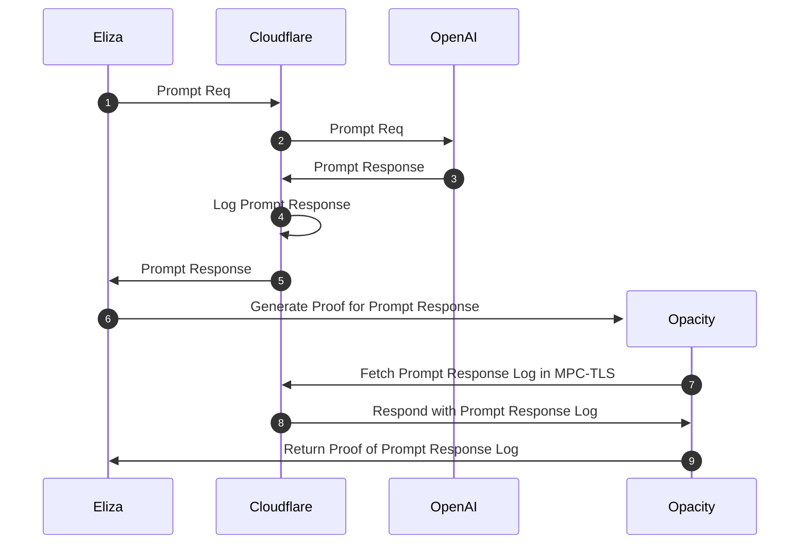

# @elizaos/adapter-opacity

This adapter integrates Opacity proofs into ElizaOS, enabling verifiable inference results from various AI model providers available through the [CloudFlare AI Gateway](https://developers.cloudflare.com/ai-gateway). It implements the `IVerifiableInferenceAdapter` interface, making it compatible with other verifiable inference solutions.

## Installation

```bash
pnpm add @elizaos/adapter-opacity
```

## Configuration

Add the following environment variables to your `.env` file:

```env
OPACITY_TEAM_ID=f309ac8ae8a9a14a7e62cd1a521b1c5f
OPACITY_CLOUDFLARE_NAME=eigen-test
OPACITY_PROVER_URL=https://opacity-ai-zktls-demo.vercel.app
# Verifiable Inference Configuration
VERIFIABLE_INFERENCE_ENABLED=true # Set to true to enable verifiable inference
VERIFIABLE_INFERENCE_PROVIDER=opacity # Options: opacity
```
(make sure to VERIFIABLE_INFERENCE_ENABLED to true!)

## Usage

```typescript
import { OpacityAdapter } from "@elizaos/adapter-opacity";
import { VerifiableInferenceOptions } from "@elizaos/core";

// Initialize the adapter
const opacityAdapter = new OpacityAdapter(runtime, {
    teamId: process.env.OPACITY_TEAM_ID,
    teamName: process.env.OPACITY_CLOUDFLARE_NAME,
    baseUrl: process.env.OPACITY_PROVER_URL
});

// Generate text with verifiable results
const options: VerifiableInferenceOptions = {
    // Optional: Override the default endpoint
    endpoint: "https://custom-api.example.com",
    // Optional: Add custom headers
    headers: {
        "X-Custom-Header": "value",
    },
    // Optional: Provider-specific options
    providerOptions: {
        temperature: 0.7,
    },
};

const result = await opacityAdapter.generateText(
    "What is Rust?",
    "gpt-4",
    options
);

console.log("Response:", result.text);
console.log("Proof:", result.proof);

// Verify the proof
const isValid = await opacityAdapter.verifyProof(result);
console.log("Proof is valid:", isValid);
```

## Features

- Implements `IVerifiableInferenceAdapter` interface for standardized verifiable inference
- Support for multiple AI model provider, in the future may be expanded to accomdate for all gateways [supported by CloudFlare](https://developers.cloudflare.com/ai-gateway/providers/)
- Customizable options for each request
- Built-in proof verification

## Response Format

The adapter returns a `VerifiableInferenceResult` object containing:

```typescript
{
    text: string;           // The generated text response
    proof: unknown;         // The proof data
    provider: string;       // The provider name (e.g., "opacity")
    timestamp: number;      // Generation timestamp
    metadata?: {           // Optional metadata
        modelProvider: string;
        modelClass: string;
        endpoint: string;
    }
}
```

## How it Works

The Opacity adapter wraps AI model API calls to CloudFlare, then performs MPC-TLS on the logged responses.


This allows you to:
1. Make verifiable API calls to AI model providers
2. Generate proofs of the responses
3. Verify the authenticity of the responses
4. Ensure the responses haven't been tampered with

## Step By Step


## License

MIT
